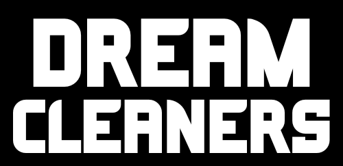
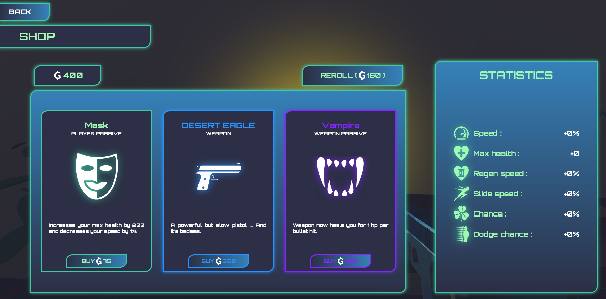
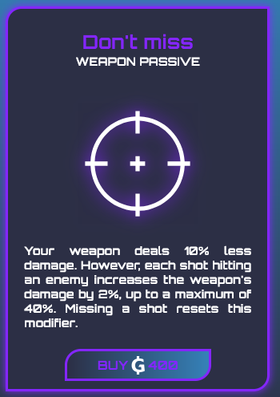
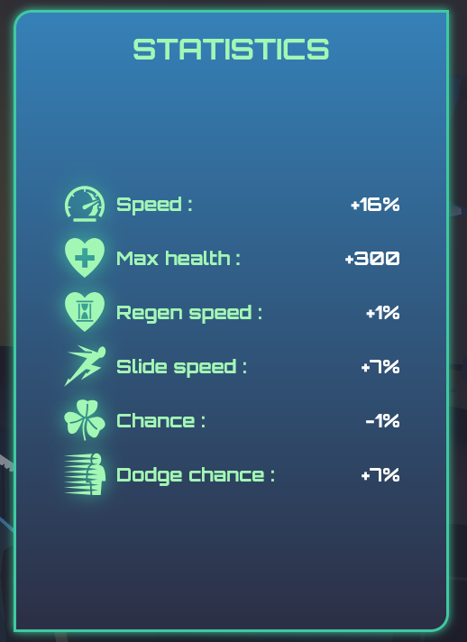
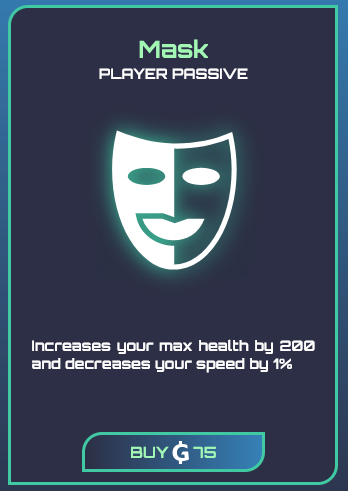
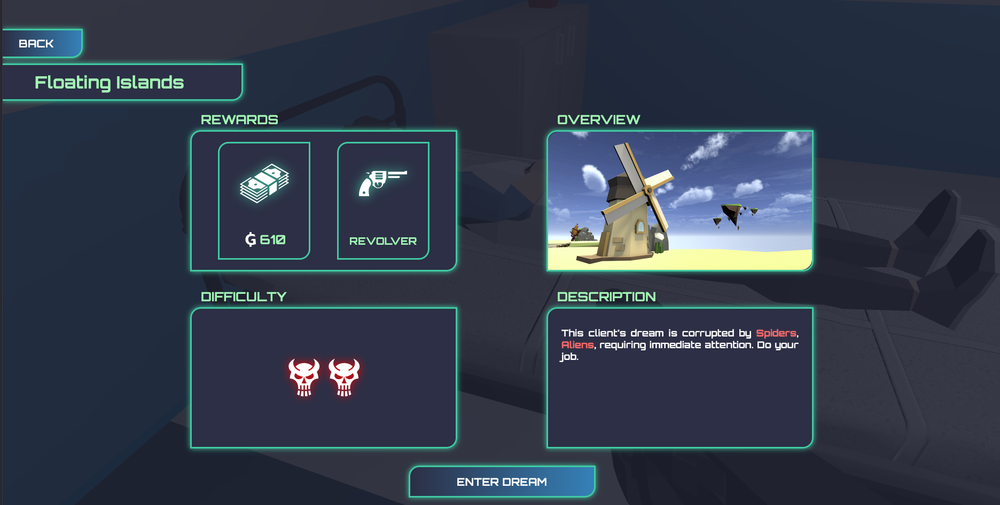

  

 

# Dream Cleaners

Bienvenue chez DreamCleaners !  
En tant qu’employé de notre célèbre entreprise, votre rôle est simple: entrer dans les rêves de nos chers clients et passer un petit coup de balai afin que ces derniers puissent passer une paisible nuit.   
Au détail près qu’ici, la poussière est remplacée par des monstres nés de l’imagination de leur hôte, et votre balais … par une bonne vieille arme à feu.

## Comment jouer ?
Notre jeu est hebergé sur Itch.io: <a href="https://doori4n.itch.io/dream-cleaners">DreamCleaners</a>  
Si vous rencontrez des problèmes de FPS, nous vous recommandons de tester sur un autre navigateur.

## Vidéos
<a href="https://youtu.be/EBghDwRl0IQ">Trailer - Youtube</a> 
<a href="https://youtu.be/4VdWw2Gob2Q">Gameplay début de run - Youtube</a> 
<a href="https://youtu.be/M_S6J8sgZv0">Gameplay avancé - Youtube</a> 
 

## Qu’est-ce que DreamCleaners ?

Bonjour ! Nous sommes une petite équipe de deux étudiants en master informatique en alternance, Dorian Girard et Dorian Fornali. DreamCleaners est un jeu web développé avec BabylonJS dans le cadre du concours Games on Web 2025. Notre volonté en participant à ce concours était de s’amuser avant tout en développant un jeu vidéo qui nous plairait, et de pouvoir souffler en s’éloignant des cours de l’université et du travail en entreprise.  
L’idée de base était de faire un FPS qui se veut “nerveux”, à la Quake ou Dusk, avec des éléments roguelike. A cela nous voulions ajouter un peu de légèreté avec de l’humour décalé, c’est de là qu’est venue l’idée de DreamCleaners: une entreprise dystopique qui enverrait ses employés dans les rêves des clients habités par des hordes de monstres, tout en omettant de préciser que toute mort, même dans le rêve, est définitive. Une entreprise tout à fait dans la légalité donc.

Ce readme est l’occasion pour nous de présenter succinctement le jeu et ses mécaniques, pour une explication technique des choix d’implémentation, consultez ce document: [README Technique](./technicalREADME.md)

Voyons ensemble en quoi consiste une partie de DreamCleaners.

## Déroulé d’une partie

Une “partie” de DreamCleaners, ou une “run” pour les habitués de roguelike, consiste en une succession de stages, ou niveaux (les rêves des clients) où le joueur affronte diverses créatures et dont le but et d’arriver à la fin, entrecoupés de séquences sans combat au hub, le bureau de l’employé. Le but est simple car il n’y en a tout simplement pas: aller le plus loin possible, enchaîner les stages et prendre plaisir à gagner en puissance au fur et à mesure des rêves nettoyés.

Le jeu propose un système d’argent, sous la forme de primes gracieusement offertes par l’entreprise à chaque rêve nettoyé (quelle bienveillance !). Chaque rêve se voit octroyer une récompense d’argent fixe pour son nettoyage, mais votre employeur vous versera un bonus si vous le faites vite et bien (en d’autres mots, la quantité de créatures éliminées et la vitesse à laquelle c’est fait vous fera gagner davantage). 
Normalement, la mort du joueur met fin à la partie, mais dans le cadre de ce concours, nous avons laissé la possibilité de charger une sauvegarde précédente 🙂.

### Le HUB
Le hub, ou “lobby”, modélisé par le bureau de l’employé et de la chambre où dorment les clients, est un espace sans danger, où le joueur a la possibilité de s’équiper avant d’aller nettoyer un rêve.

###     L’ordinateur

Au sein du HUB, le joueur a accès à un ordinateur avec lequel il peut interagir, et à partir duquel il va pouvoir acheter divers objets lui permettant de mieux se préparer aux hordes de monstres dans les rêves.
Sont présentés au joueur trois choix d’objets aléatoires, libre à lui de relancer les choix afin de tenter d’obtenir de meilleurs objets à acheter, mais cette opération est payante. Il n’y aucune restriction sur le nombre d’objets qu’il peut acheter en une fois, tant qu’il lui reste de l’argent, il peut bien vider les stocks !

Chaque “objet” est d’une rareté fixée, cette rareté influe sur la probabilité d'être proposé dans l’ordinateur, mais aussi sur son prix d’achat.

Parmis ces objets on en retrouve trois types:

### Les armes

Bien que l’employé se voit attribuer une arme de départ par son entreprise bien-aimée, cette dernière est de qualité basique et perdra vite de son utilité au fur et à mesure de la partie.
L’ordinateur pourra donc proposer des armes à acheter par le joueur.
Il existe actuellement 11 armes sur DreamCleaners, chacune peut être d’une rareté allant de Commune (1) à Légendaire (4), influant sur ses caractéristiques.
Outre la rareté, chaque arme possède des caractéristiques différentes, que ce soit les dégâts, la portée, la cadence ou bien des points plus spécifiques comme des armes à rafale ou semi-automatiques ! Chacune de ces 11 armes est animée et accompagnée d’effets sonores uniques, n’hésitez pas à toutes les tester !

Le joueur peut s’équiper de deux armes maximum, acheter une troisième lui demandera alors de remplacer une parmi les deux déjà présentes.

### Les passifs d’arme

Le deuxième type d’objet que l’ordinateur peut proposer est le passif d’arme.
Un passif d’arme est un bonus applicable à une arme qui va augmenter son efficacité en ajoutant par exemple une mécanique de jeu, et possiblement en augmentant ses caractéristiques.

 <i>Passif d'arme "Don't miss"</i>

Le joueur ne peut pas appliquer deux fois le même passif à une même arme, il n’y a en revanche aucune limite sur le nombre de passifs distinct applicables à une arme.
Amusez vous à casser le jeu en appliquant tous les passifs légendaires à une seule et même arme !!

### Les passifs joueur

Enfin, l’ordinateur peut proposer un dernier type d’objet, les passifs joueur.
Vous l’avez deviné, ces derniers offrent des bonus statistiques au joueur.
Voici toutes les statistiques qui peuvent être affectées par ces passifs:

 <i>Statistiques joueur</i>
  
Contrairement aux passifs d’armes, acheter plusieurs fois le même passif joueur aura pour effet de cumuler ses effets. Attention cependant, car certains passifs joueur viennent avec leurs bonus comme leurs malus.

 <i>Passif joueur "Mask"</i>
  

<small><i>
Toute ressemblance de l’ordinateur avec une machine de casino est fortuite, il n’est absolument pas dans l'intérêt de DreamCleaners de rendre addicts ses employés afin de les empêcher de démissionner.
</i></small>

### L’établi

En supplément de l’ordinateur, le joueur à accès à un établi avec lequel il peut interagir dans le Hub. Cet établi propose la possibilité d’améliorer en qualité les armes équipées, et leurs statistiques avec. Un moyen sûr de gagner en efficacité dans les rêves.

### Entrer dans un rêve

Toujours dans le Hub, vous pouvez retrouver dans la pièce d’à côté les clients qui dorment.
Vous approcher des lits vous permettra d’interagir avec, et vous serez capables de visualiser des informations sur le rêve du client. Ne me demandez pas comment ça marche.

Vous pourrez alors consulter des informations sur le rêve : le lieu du rêve, son niveau de dangerosité, lié à la férocité des entités qui y rôdent, mais aussi un aperçu des créatures que l’esprit du client a fait surgir. Araignées, serpents… yétis ? Parfois les clients ont des imaginaires .. particuliers.

Vous pourrez aussi visualiser la récompense du stage, magnanimement conférée par DreamCleaners, qui peut contenir de l’argent mais aussi une arme qui pourra possiblement déjà être équipée de passifs d’arme. Attention cependant, car plus la récompense est grande, plus la difficulté croît.

Faites alors votre choix et entrez dans le rêve.

## Nettoyer le rêve

A l’intérieur du rêve, votre but est simple: faire le ménage.
Bon, en réalité il s’agit d’atteindre le point d’arrivée du rêve, marqué d’un petit drapeau. Sur le chemin, vous serez attaqués par des hordes de créatures très mécontentes qu’un autre intrus vienne les déranger.
Attention cependant car votre performance à l’intérieur du rêve sera attentivement surveillée par DreamCleaners. Pour s’assurer que son employé se porte bien évidemment !
Ainsi, nettoyer le rêve rapidement, sans se faire toucher, et en s’assurant de bien éliminer chaque créature vous octroiera un bonus en fin de mission, allant jusqu’à doubler la récompense en argent prévue initialement !

Il existe actuellement 2 lieux où le rêve peut se dérouler, un que nous avons créé à la main, et le deuxième généré procéduralement, changeant donc à chaque rêve.

Une fois le rêve nettoyé, vous sortez du rêve et êtes renvoyés dans le Hub où vous pourrez alors dépenser à l’ordinateur ou l’établi cet argent durement gagné. 
La difficulté des rêves croît au fur et à mesure de la partie, donc préparez-vous bien !

Amusez-vous bien sur DreamCleaners !

## Développeurs

Dorian GIRARD  
Dorian FORNALI
