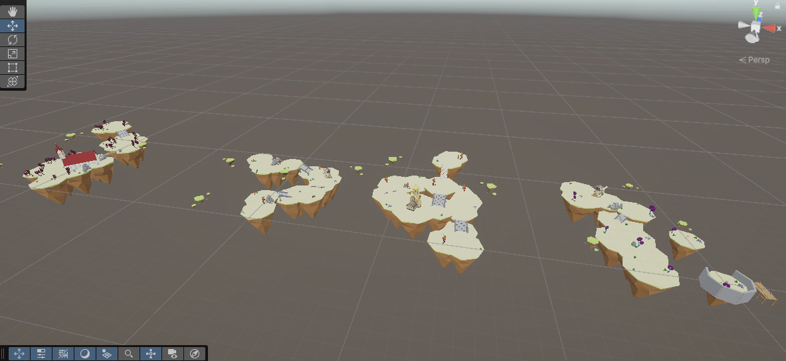
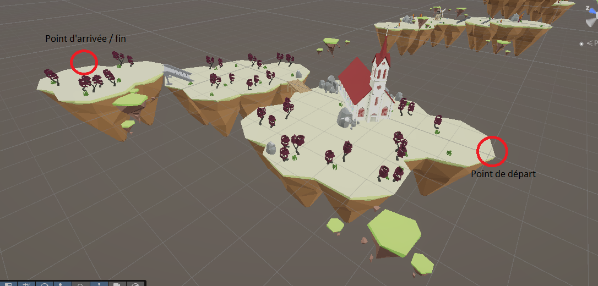
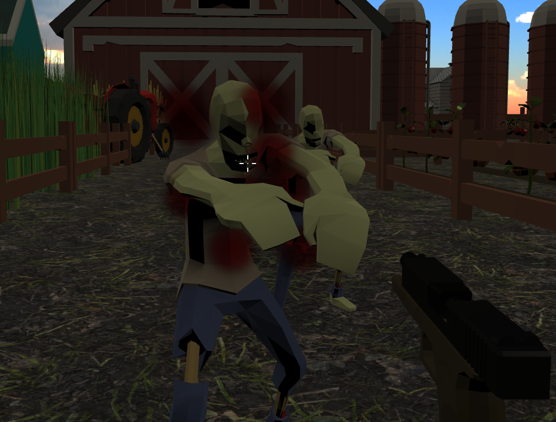
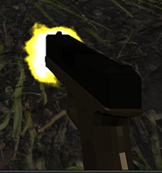
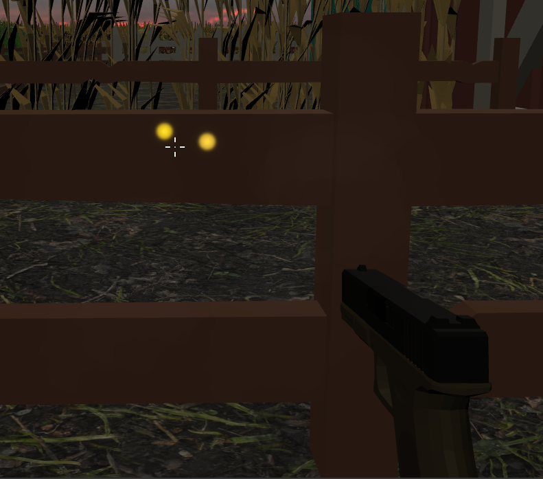
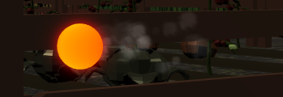
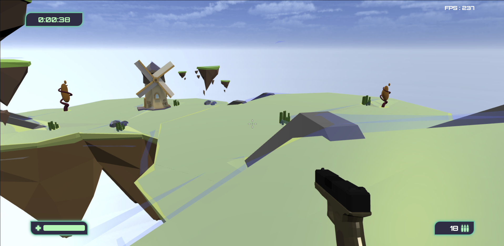

# Dream Cleaners - Documentation technique

Dans ce document, nous aborderons l'aspect technique de ce projet, en expliquant notamment notre organisation, mais aussi en se penchant sur le code en discutant de quelques points dans nos choix d'implémentation et d'utilisation du moteur BabylonJS.  
C'est l'occasion de discuter de la technique derrière ce jeu contrairement au [README.md](./technicalREADME.md) qui en est une description générique.

## Organisation de l'équipe

Pendant les premiers mois nous nous sommes penchés sur la conceptualisation en elle-même: quel style de jeu, quel gameplay, quel "lore" ? Notre premier embryon de concept était un jeu fondamentalement différent de l'actuel, un jeu de survie à la 'The Forest', où le temps passé sur l'île affectait la santé mentale du joueur ce qui modifierait dynamiquement tout son environnement, comme s'il passait petit à petit dans un monde de cauchemar où ce même environnement tentait de le nuire.  
Cette idée a été abandonnée car jugée trop complexe pour si peu de temps. 
Nous sommes ensuite partis sur le DreamCleaners actuel, un objectif plus réalisable.
Cette phase préparatoire nous a aussi permis d'élaborer quelque brouillons d'architecture du code et surtout un MVP, c'est-à-dire un ensemble restreint et minimal de fonctionnalités parmis toutes les idées que nous avions, pour avoir un objectif réalisable.  C'est mi-février que nous avons commencé le développement à proprement parler, en parallèle du travail à l'université et en entreprise, étant tous les deux alternants.
  La phase de développement était accompagnée de l'utilisation d'un tableau Kanban pour séparer nos objectifs en petites tâches et pouvoir facilement se les répartir.
La répartition en elle-même se faisait au gré de chacun, nous avons tous les deux été touche-à-tout dans ce projet.

## Création des rêves / stages / maps
Premier point que nous souhaitions aborder: les rêves en eux-mêmes, que l'on appelle stages.
Il nous fallait une manière de créer ces stages (scènes) facilement, c'est-à-dire disposer des objets sur la scène pour rendre l'environnement réaliste. Dans ces objets on comprend le décor mais aussi les lumières, même les ennemis. 
La meilleure manière que nous connaissions était de faire tout ce travail (hormis les ennemis) sur Unity. Nous avons donc crée une scène unity de test, dans laquelle nous disposions des éléments de décors et des lumières.  Il fallait ensuite réfléchir à une manière de transférer cette scène Unity en une scène BabylonJS. Nous avons utilisé glTFast, un package Unity qui permet l'export d'une scène entière en un seul objet GLB.
 Cet objet garde alors la hierarchie de l'éditeur unity avec les gameobjects et leurs enfants, et diverses informations les concernant, notamment le nom de l'objet. 
En chargeant coté Babylon cet objet comme on chargerait n'importe quel mesh, on parvient avec succès à charger l'ensemble de la scène. 
Mêmes les lumières sont exportées de cette manière, avec quelque bugs malheureusement, limitant notre utilisation des lumières pour la création des scènes.
Seule la "hitbox" des objets n'est pas transferée, donc aucun objet n'avait de collisions. 
Nous avons alors mis en place un parser coté BabylonJS qui allait regarder la hierarchie du GLB exporté depuis unity et les noms de tous les objets. Côté Unity, nous nommons nos gameobjects avec des tokens permettant à babylon lors du parsing de savoir quel type d'objet c'était. 
Par exemple, tout objet nécéssitant la création d'une hitbox (physics aggregate) était nommé #O-B#, pour Object - Box, où Box signifie que l'on va créer pour cet objet un physics aggregate de type box. #O-M# pour une hitbox de type mesh, #O-C# pour convex. 
De cette manière, nous avions une bonne manière de facilement créer nos scènes sur Unity, les transférer sur Babylon, et qu'elles y soient fonctionnelles. 

### Spawn des ennemis
Additionellement, nous avons géré l'apparition des ennemis directement dans la scène Unity. 
Cela nous a permis de directement placer des points d'apparition (#S#) et un point de "spawn trigger" (#T-X#) signifiant coté Babylon la création d'une hitbox sphérique de rayon X, dont la collision permet l'apparition d'ennemis aux emplacements des objets #S# enfants du #T-X#.

Cependant, et même avec ce système, créer à la main de multiples scènes est usant et très long.
C'est pourquoi nous avons mis en place une seconde manière de créer nos scènes, tout en se basant sur le système précédent:

## Génération procédurale

C'est ainsi que nous avons eu l'idée de générer procéduralement des scènes.
Notre style de jeu est supposé être rejouable quasiment à l'infini, il faut donc que le joueur puisse enchainer les rêves sans avoir l'impression de toujours faire la même chose.
Le principe est le suivant: nous créons des "salles" sur Unity (avec le même principe qu'expliqué précedemment), qui seront les composants de la scène générée. Ces salles ont deux "ancres" qui donneront la position de "départ" (par où arrivera le joueur) et la position de fin (par où partira le joueur). Ensuite, notre algorithme va prendre un certain nombre de ces salles préfaites et les agencer aléatoirement, en respectant ces départ et fins pour qu'une fin amène à un départ etc ...
Nous avons aussi une salle de "spawn", par lequel le joueur commencera toujours le rêve, et une salle de fin par lequel le joueur terminera toujours le rêve.

<i> Salles composant la scène des îles volantes </i>

<i> Focus sur une salle </i>

## Système de sauvegarde

Pour expliquer comment nous sauvegardons la partie, nous avons un [SaveManager](./src/lib/saveManager.ts) qui s'occupe de sauvegarder, restaurer une sauvegarde, et réinitialiser la sauvegarde à des moments clés (entrée dans le hub, sortie d'un rêve ...). Cette sauvegarde se fait dans le localstorage du navigateur. Les objets qui doivent bénéficier de ces trois fonctionnalités implémentent une interface [ISaveable](./src/lib/saveable.ts) et donc les trois méthodes save(), resetSave(), restoreSave(). 
Ensuite, nous notifions au SaveManager les objets ISaveable qu'il doit s'occuper de gérer en en gardant la trace et en actionnant leurs sauvegarde etc. 
C'est donc chacune des classes implémentant l'interface qui doit implémenter sa manière d'être sauvegardé, par exemple l'[inventaire du joueur](./src/lib/player/playerInventory.ts) va devoir serialiser les informations des armes du joueur, leurs passifs d'arme, mais aussi les passifs joueur.  Ensuite, lorsque l'on restaure la sauvegarde, nous recréons dynamiquement tous ces objets et réappliquons (dans le cas des passifs) leurs effets.

## VFX

Les effets visuels sont un élément crucial de notre jeu.
  En effet notre volonté est de rendre le jeu "nerveux", rapide et agréable et nous pensons que les effets visuels y sont pour beaucoup.
  Dans ce sens nous avons mis l'accent sur cet aspect avec notamment:
- Animation de l'arme lorsque le joueur marche, en fonction de sa vitesse.
- Inclinaison de la caméra lors des déplacements pour donner un effet de vitesse
- Utilisation d'un système de particules (natif BabylonJS) pour créer des impacts de balle sur les ennemis (giclée de sang), l'explosion des ennemis à leur mort, un muzzle flash, c.a.d la lumière causée par le tir d'une arme à feu, mais aussi les impacts de balles sur les murs ou encore la fumée s'en dégageant.

  <i>Effet de sang à l'impact</i>

  <i>Muzzle flash</i>

  <i>Effet de tir sur un mur avec de la fumée et des étincelles</i>
 

Nous pouvons aussi mentionner en effets visuels les boules de feu des ennemis attaquant à distance: 
Nous avons d'abord mis un filtre de surbrillance et crée un shader avec le node material editor de BabylonJS, permettant de définir le shader avec des nodes et non pas avec du code. Le shader donne une texture proche du feu, et non avons rajouté une trainée de fumée derrière:

  <i>Boule de feu</i>

## Mouvements du joueur

Toujours dans la volonté de rendre le jeu rapide et "nerveux", les mouvements y participent beaucoup selon nous.  
Nous avons donc rajouté en plus des mouvements classiques (gauche droite derriere devant, sauter) une glissade, accélèrant très légèrement le joueur.  Il est par exemple possible d'annuler cette glissade en plein milieu et sauter, le saut gardant la vélocité actuelle du joueur. Ainsi le joueur peut techniquement glisser, profiter de la vitesse supplémentaire de la glissade pour sauter et donc profiter d'un saut rapide. C'est un exemple de mécanique dans notre jeu, qui, nous l'esperons, permet au joueur de s'amuser et bénéficier d'une sensation de vitesse et liberté.

## Interface

Petit point sur l'interface: nous avions besoin d'un style retro-futuriste, quelque chose de simple mais soigné. Aucun asset libre de droit ne nous plaisait alors nous avons fait nous même notre style d'UI en pur CSS et SVG.

## Système d'armes et ennemis

### Armes

La gestion des armes se fait intégralement par un fichier json.
Le but derrière cette implémentation était de pouvoir rendre completement indépendante l'arme de son comportement. Par exemple, pouvoir rendre un fusil à pompe automatique ou augmenter sa portée, ses dégats, la capacité de son chargeur, simplement à partir du fichier json.
Cela se traduit dans le code par une seule classe commune à toutes les armes, weapon.ts.

C'est très pratique pour créer de nouvelles armes, car elles entreront forcément dans les cas d'usage couverts par notre implémentation.
Cependant, si on essaie de sortir des rails et créer par exemple une arme au comportement singulier, comme un lance roquettes, cela demanderait sa propre implémentation.

Petit point sur ce json: il nous permet aussi de spécifier la configuration du mesh en lui même, où le positionner pour donner l'impression de porter l'arme en main droite, quelle échelle lui donner, etc. Cela peut s'avérer complexe car les mesh des armes venant de sources différentes, les artistes les concoivent différemment et nécessitent chacun une gestion différente.  Voir [weapons.json](./src/assets/data/weapons.json) si cela vous intérèsse.

### Ennemis

Le système d'ennemis est très proche de celui des armes: [un fichier json](./src/assets/data/enemies.json)
 pour déclarer chaque type d'ennemi, ses animations, son mesh, mais aussi ses statistiques.
De la même manière que pour les armes, un seul fichier enemy.ts gère toute sorte d'ennemis.

Concernant leurs déplacements, nous utilisons le plugin RecastJS pour gérer les déplacements intelligents des ennemis via un NavMesh (Navigation Mesh). Ce système permet de calculer automatiquement les chemins accessibles dans un environnement 3D, sans avoir à gérer manuellement le pathfinding. 
On génère ce navmesh à partir de la scène et de paramètres (comme la taille des voxels, la hauteur maximale du plafond, l'inclinaison des surfaces ...).
Ensuite, nous définissons des agents (les ennemis) et ces derniers vont se déplacer uniquement sur ce navigation mesh. En fonction des paramètres qu'on aura donné aux agents, comme leur vitesse, RecatJS va calculer les plus courts chemin vers le joueur et par exemple séparer les ennemis s'ils sont trop proches.

 <i>Navmesh sur une île volante, sol bleu</i>

## Animations

### Armes
Chaque arme dispose d'une animation de tir et de rechargement.
Nous avons conçu chacune de ces animations nous-même sur blender (à 2 exceptions près: le tir du desert-eagle et le tir du glock).
Ces animations sont ensuite gérées dans le code, c.a.d qu'elles sont accélérées ou ralenties pour coïncider avec le temps effectif du tir ou du rechargement.

### Ennemis
Quant aux ennemis, nous avons pris soin de sélectionner des mesh disposant déjà d'animations. Nous avons spécifié depuis le fichier json quelle animation utiliser pour quelle action, et dans le code on se contente d'aller actionner telle ou telle animation.

## Gestion du son
Pour le son, nous nous sommes basés sur l'API WebAudioEngineV2 de BabylonJS.
Nous avons un AudioSystem, façade de cette API, et par dessus cela nous avons mis en place un AudioManager, avec des implémentations plus proches de nos utilisations réelles dans le code.

Tout ce qui gravite autour du son est délicat, il faut une implémentation soignée qui permette de stocker les sons et les réutiliser mais aussi de les nettoyer si on ne les utilise pas.
C'est donc ce que nous avons fait, avec aussi par exemple un pré-chargement de certains sons / musiques que l'on sait qui vont être utilisés.

Nous utilisons des <a href="https://doc.babylonjs.com/typedoc/classes/BABYLON.StreamingSound">'streaming sounds'</a> pour ce qui est des musiques destinées à ne pas être spatialisées, et des <a href="https://doc.babylonjs.com/typedoc/classes/BABYLON.StaticSound">'static sounds'</a> pour les sons non spatiaux (hors musiques) comme notamment les sons d'UI.

### Spatialisation des sons
Nous avions besoin, pour une meilleure immersion, d'utiliser des sons spatialisés, donc que l'on puisse identifier par exemple un ennemi qui vienne de la droite.

Pour ce faire nous avons utilisé les sons spatiaux de BabylonJS, qui sont des static sounds en soit mais avec des options supplémentaires. Cette utilisation n'a pas été fructueuse car il nous était impossible d'actualiser la position de ces sons en fonction du joueur. Pour rentrer dans les détails, il nous était impossible de spécifier à l'audio engine qui était son listener. 
Pour fixer ce point nous avons été forcé de créer notre propre wrapper autour des sons spatiaux, qui va garder en mémoire et actualiser lui même les positions de tous les sons spatiaux joués. 
Ce wrapper dispose d'ailleurs d'un système de clean-up des sons pour optimiser l'utilisation de l'audio engine et éviter de la saturer.

### Sound design

Pour ce qui est des sons en eux-mêmes, nous avons utilisé des sons libres de droit, à part pour le Yéti que nous avons doublé nous-même (ca nous amusait). Chaque arme dispose d'un son de tir et d'un son de rechargement. 
Le son de rechargement est dynamiquement modifié pour pouvoir coincider avec le temps de rechargement de l'arme, on l'accélère donc si le son de base est plus long que le temps de rechargement ou on le ralentis dans le cas inverse. 
Les ennemis disposent aussi de sons: quand l'ennemi attaque et quand il meurt. Chaque ennemi a 3 sons différent pour sa mort.

Pour les sons très courants, comme les tirs par exemple, nous utilisons une pool de son, c.a.d une simple liste avec N sons identiques prêts à être utilisés, car utiliser le même son ne serait pas assez efficace.

## Passifs joueur / arme

Dernier point que nous allons aborder: les passifs joueur et arme.

A l'inverse des armes et ennemis, le but ici était que chaque passif ait sa propre implémentation directement dans le code, ainsi on retrouve une classe par passif distinct.  
Tous ont la même logique: une fonction apply() qui va appliquer les effets du passif au joueur, où à l'arme. Une implémentation par passif était nécéssaire, ces derniers affectant divers aspects du jeu qui ne sont pas forcément liés. Par exemple la statistique de chance affecte les taux d'obtention dans l'ordinateur, tandis que la vitesse affecte la vitesse affecte le joueur.
 Pareillement pour les passifs d'arme, "Don't miss" est une mécanique à part entière et nécéssite une implémentation directe dans l'arme, tandis que d'autres passifs n'affectent que simplement les statistiques de l'arme.

Petite aparthée sur le passif d'arme "Akimbo". Ce passif montre bien la nécessité d'avoir une implémentation distincte par passif, si vous jetez un oeil à la classe [weapon.ts](./src/lib/weapons/weapon.ts), vous verrez que tout un pan de la classe est dédiée à la gestion de l'akimbo.
 Evidemment, le mieux serait d'avoir, comme pour les armes et ennemis, une spécification des effets du passif depuis un json, et abstraire cette implémentation au maximum. Mais faire cela réduirait considérablement la flexibilité du système et ne permettrait que la création de passifs se ressemblant.

# Auteurs
Dorian FORNALI  
Dorian GIRARD